1. Silakan selesaikan praktikum tersebut sesuai langkah-langkah sebelumnya, lalu laporkan hasilnya berupa link repository GitHub dengan nama spark-sql-big-data disertai dengan screenshot hasilnya.
2. Jelaskan masing-masing maksud kode berikut sesuai nomor kodenya pada laporan praktikum Anda!
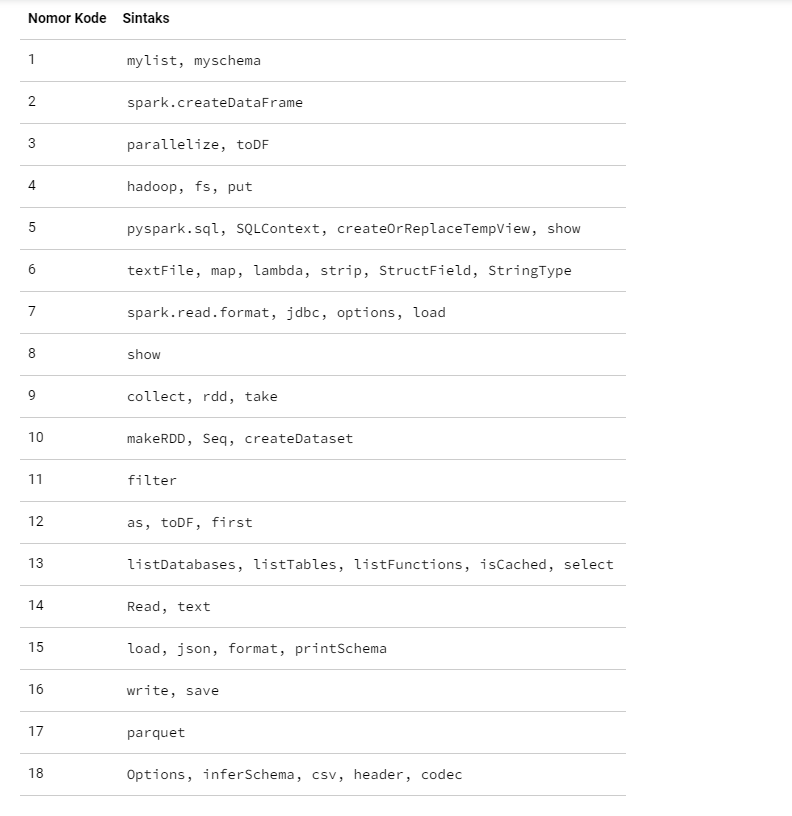
# Hasil Praktikum
# accessingMetadata
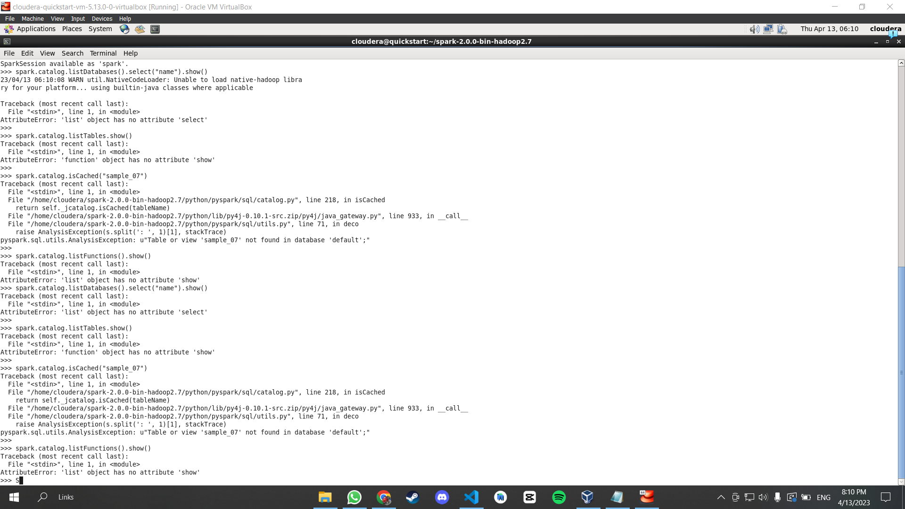
# CreatingDataFrames
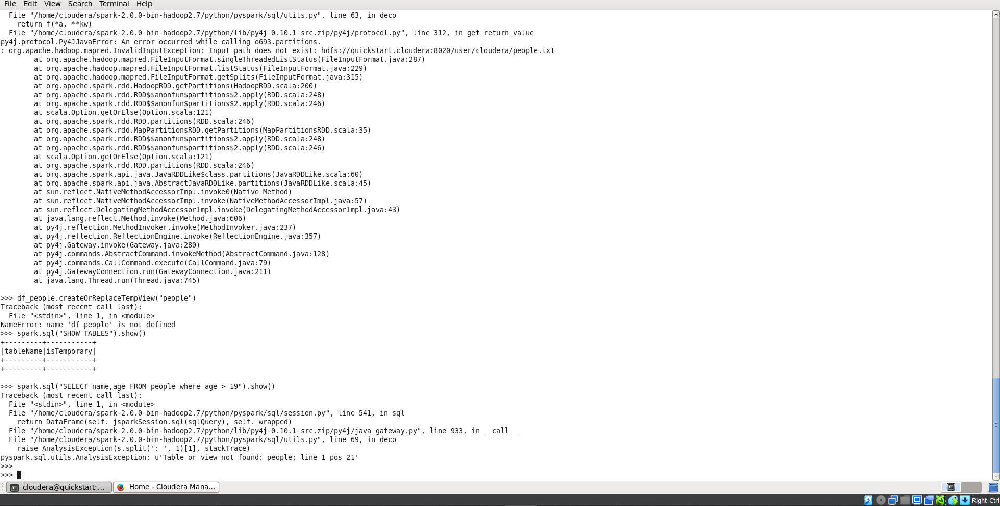
# CreatingDataFramesfromDBs
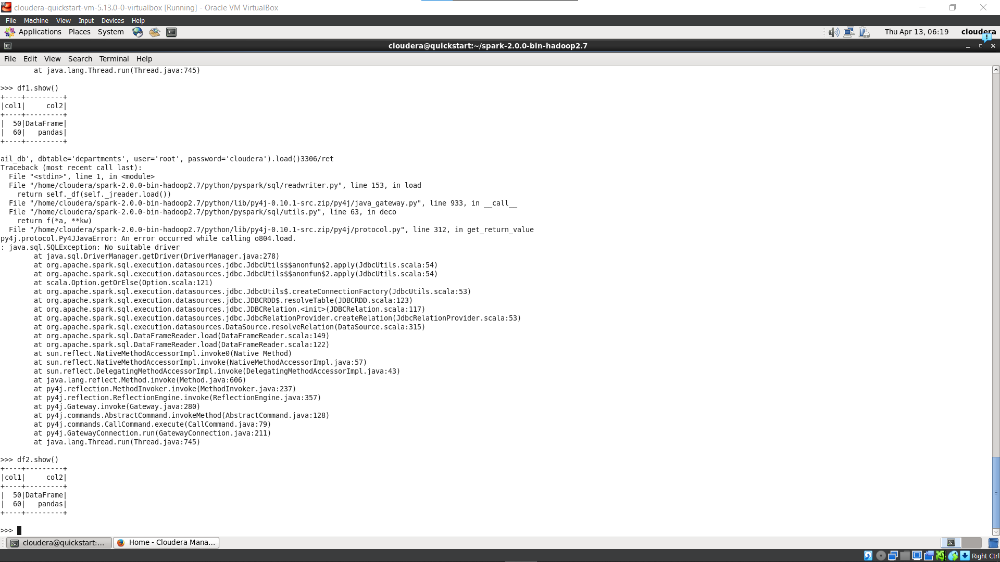
# CreatingDataFramesfromHive
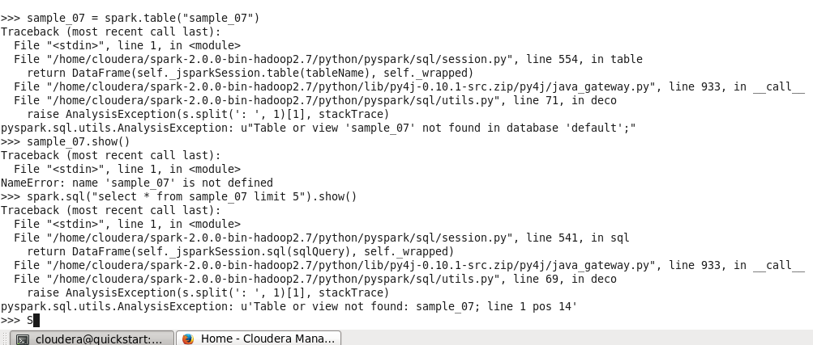
# DataFrames2RDD
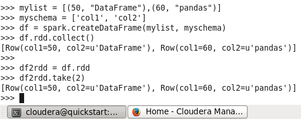
# Datasets2DataFramesViceVersa
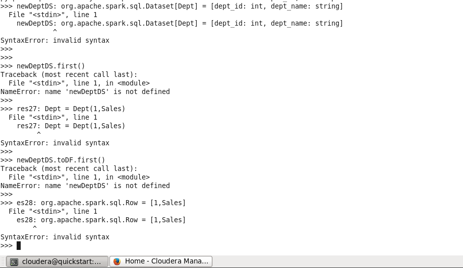
# DataSourceAVRO
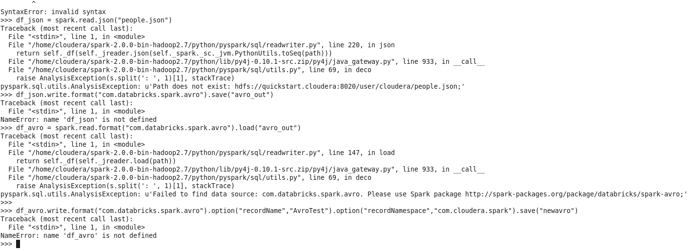
# DataSourceCSV
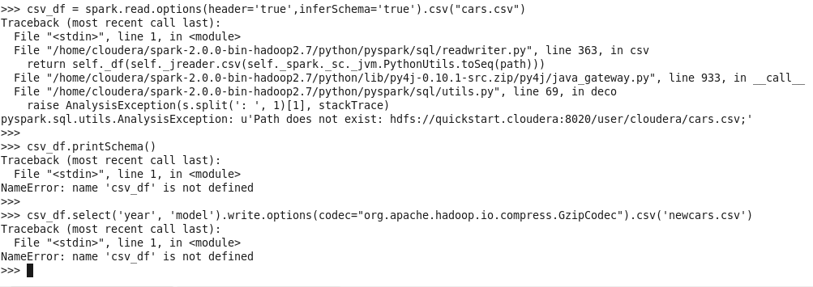
# DataSourceJson
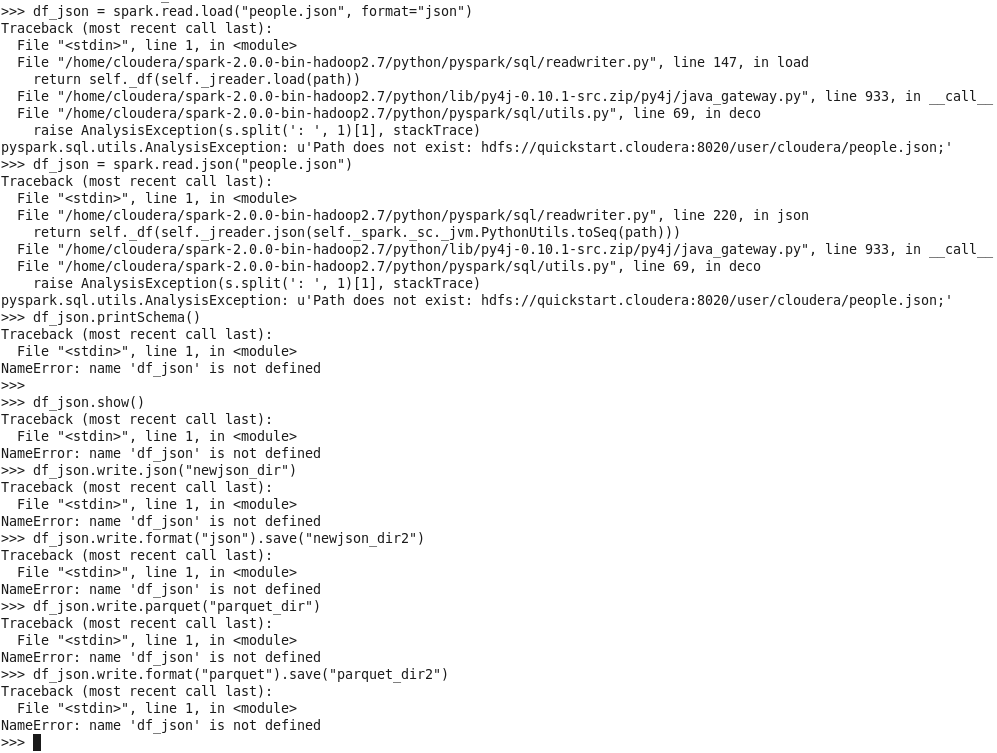
# DataSourceORC
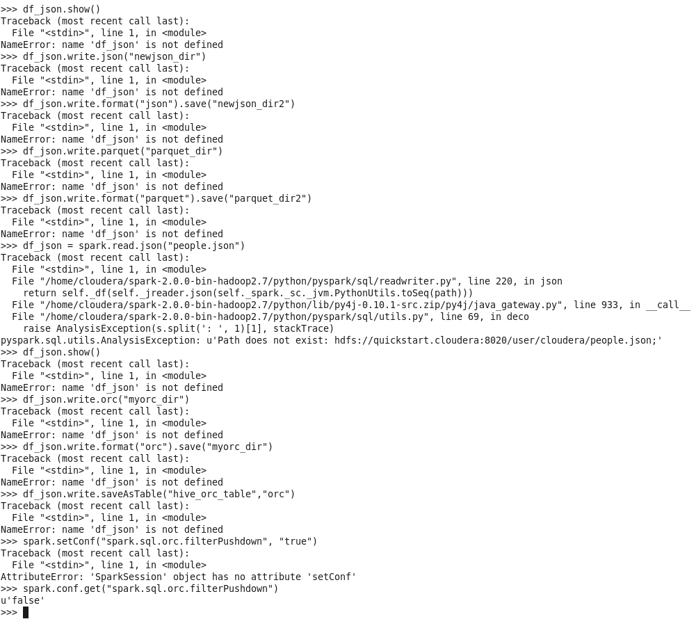
# DataSourceParquet
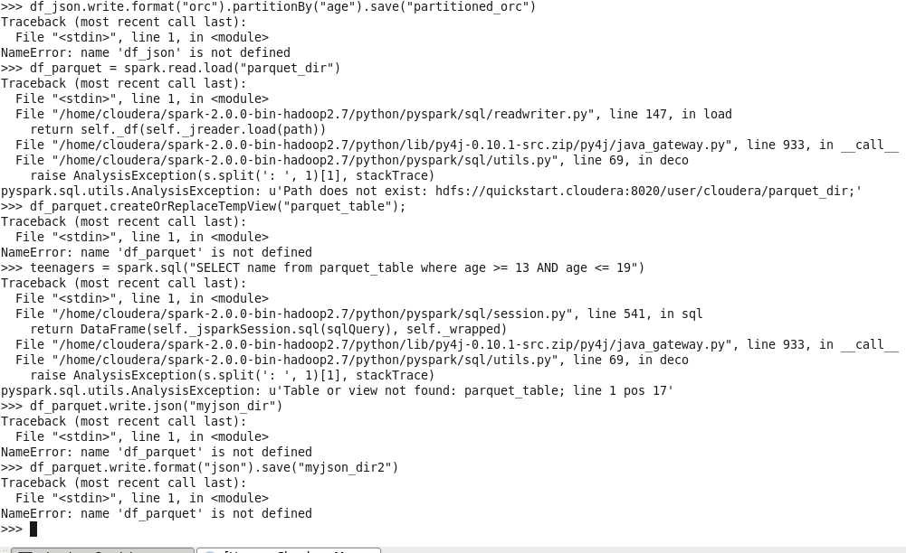
# DataSourceTEXT
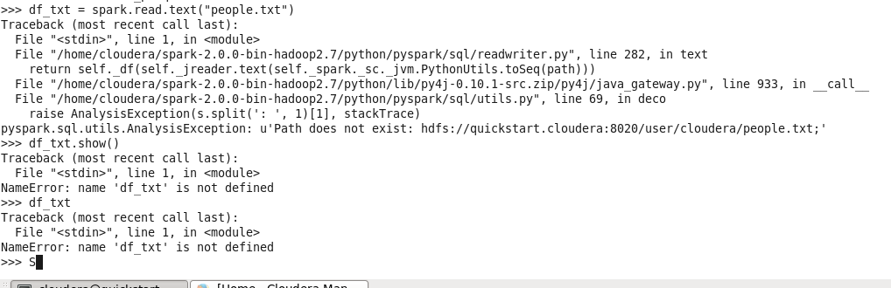
# DataSourceXML
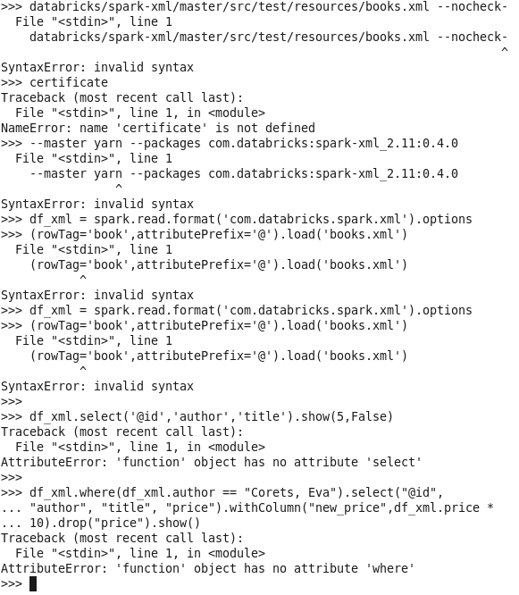
# PandasDF2DataFrame
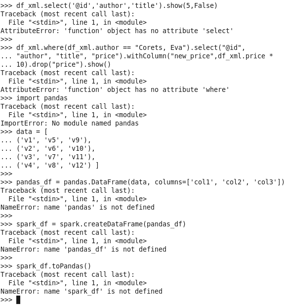
##### Komang Gede Narariya Suputra
##### 2041720225
##### TI3B
##### 10
